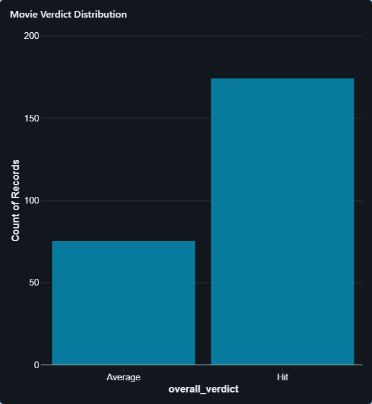
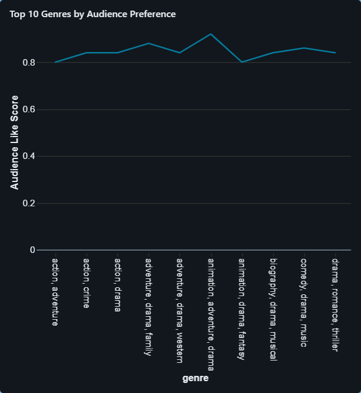
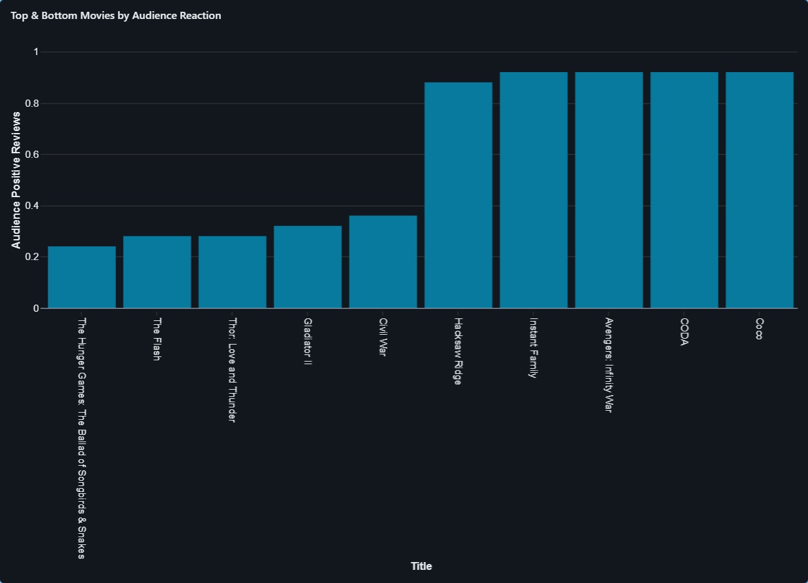

# Movie Review Sentiment Insights

## Introduction
In the social media and content ecosystem, audience opinions strongly influence content performance, platform recommendations, and investment decisions. Movie reviews, in particular, provide rich unstructured signals that reflect audience satisfaction beyond numerical ratings.This project was developed as part of the Build With Databricks: Hands-On Project Challenge, focusing on the Social Media & Content domain.
This project builds an end-to-end Data & AI pipeline on Databricks to transform raw IMDb movie reviews into actionable business insights using the Medallion Architecture (Bronze → Silver → Gold), sentiment analysis, and machine learning.
The solution enables stakeholders to understand what audiences like, what polarizes them, and where ratings and sentiment disagree, supporting data-driven content strategy decisions.

####Problem Statement
Movie platforms and content teams often rely heavily on ratings, which do not always capture true audience sentiment. Positive or negative emotions expressed in reviews may contradict ratings, leading to misleading performance evaluation.

####Objective:
Build a scalable analytics and ML solution that:
- Converts raw movie reviews into structured sentiment signals.
- Aggregates sentiment into business-ready insights.
- Identifies audience preference patterns and sentiment-rating mismatches.
- Supports decision-making for content planning, promotion, and curation.

###Medallion Architecture
##### Bronze Layer – Raw Ingestion
- Raw IMDb datasets are ingested as Delta tables without modification.
- Purpose: Preserve original data for traceability and reprocessing.
#####Silver Layer – Data Cleaning & Enrichment
- Data is cleaned, standardized, and validated.
- Reviews are enriched using sentiment analysis to extract:
    - sentiment_label (Positive / Negative).
    - sentiment_score (confidence score).
- Purpose: Create analytics- and ML-ready datasets.
##### Gold Layer – Business Insights (Declarative SQL)
- Using SQL-based declarative transformations, curated insight tables are created for stakeholders:
   - Genre-level audience preference.
   - Overall movie performance.
   - Highly polarizing content.
   - Sentiment vs rating mismatch detection.

###Machine Learning Component
Model Objective:
Predict audience sentiment from review text and validate sentiment patterns learned during enrichment.
Approach.
- Input data sourced directly from Silver table.
- Text vectorization using TF-IDF.
- Classification using Logistic Regression.
- Hyperparameter tuning for:
  - max_features.
  - Regularization strength C.
- Experiment tracking using MLflow.

Even with a simple model, this approach enables:
- Rapid sentiment classification for new incoming reviews.
- Consistent sentiment scoring at scale.
- Foundation for future recommendation or alerting systems.
- Validation of sentiment trends used in Gold analytics.
- This model can later support real-time monitoring of audience reaction for newly released content.

###📊 Dashboard & Insights
Interactive dashboards were built using Gold tables to visualize:
- Genre-wise audience sentiment.
- Comparison between ratings and emotional response.
- Review engagement patterns across genres.
- These dashboards help business users quickly identify content trends and audience preferences.

###Technology Stack
- Platform: Databricks.
- Languages: Python, SQL.
- Processing: PySpark.
- Storage: Delta Lake.
- ML: Scikit-learn, MLflow.
- Governance: Unity Catalog.
- Visualization: Databricks SQL Dashboards.

###Future Enhancements
- Multiclass emotion detection (anger, joy, disappointment).
- Aspect-based sentiment (story, acting, direction).
- Real-time streaming ingestion for live reviews.
- Integration with OTT recommendation engines.
- More advanced NLP models (BERT-based).

###Conclusion
This project demonstrates how Databricks can be used to unify data engineering, analytics, and machine learning into a single, production-ready workflow. By transforming unstructured reviews into trusted insights, the solution helps content teams move beyond ratings and make audience-centric decisions backed by data.